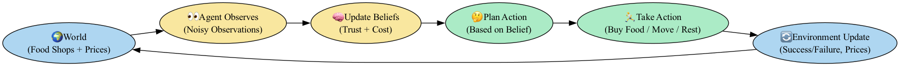

# 🧠 Multi-Agent Competition Simulator

[](https://www.python.org/downloads/release/python-3100/)
[](https://streamlit.io/)
[](LICENSE)
[]()

---

Welcome to the **Multi-Agent Competition** project!  
This simulation models a world where multiple intelligent agents compete for limited resources (food shops) to survive as long as possible.  
Each agent learns over time using a form of **Reinforcement Learning (Q-learning + Epsilon-Greedy)** and **Partially Observable Markov Decision Processes (POMDP)**.

Agents are now fully customizable, and a professional dashboard visualizes their learning, survival, and decision strategies over time! 🚀

---

## 🧠 Workflow Overview




- 🌎 **Customize the World:** Shop prices, energy gains, success rates.
- 👥 **Build Your Agent Team:** Explorers, Greedy, Cautious, and CheapOnly agents.
- 🔁 **Train Across Multiple Episodes:** Agents survive, adapt, and compete.
- 🧠 **Observe, Update, Act:** Agents learn under uncertainty (POMDP).
- 🎬 **Watch Animated Learning Curves:** How agents evolve over time.
- 📊 **Analyze Survival and Lifetime:** Track who lasts longest!
- 📥 **Download Flowcharts and Results:** (Coming soon!)
- 🎬 Example of Agent Score Animation:
  
  
---

## 📦 Project Structure

```plaintext
multi_agent_project/
|
+-- agents/
|   +-- agent.py               # Basic Agent class: Q-learning, actions, decisions
|   +-- agent_pomdp.py          # Smarter POMDP-based Agent class (observes noisy world)
|   +-- agent_variants.py       # Explorer, Greedy, Cautious, CheapOnly agent variations
|
+-- environment/
|   +-- world.py                # Simple environment for basic agents
|   +-- world_pomdp.py          # Dynamic world manager (shop price changes, randomness)
|
+-- pages/
|   +-- 1_POMDP_Multi_Agent_Training.py # Streamlit app for training, visualization, and analysis
|
+-- data/                       # Folder for saving experiment results
+-- results/                    # (Optional) Plots, logs, survival statistics
|
+-- run_simulation.py           # Old basic script (for simple agent testing)
+-- run_pomdp_simulation.py      # New POMDP-based simulation runner
+-- README.md                   # You are here!
```

---
### 🚀 How to Run
```bash
pip install -r requirements.txt
```

```bash
python3 run_pomdp_simulation.py
```

```bash
streamlit run pages/1_POMDP_Multi_Agent_Training.py
```
- ✅ Customize the environment
- ✅ Build your agent team
- ✅ Visualize training, survival, lifetime and outcomes!

---
## 📢 Future Roadmap
- 📈 Animate Belief Trust Evolution across episodes

- 🥇 Auto-generate Agent Leaderboards

- 🛠️ Support for Multi-city Worlds (more complex environments)

- 🧪 Add More Agent Strategies (e.g., Risk-Seeking, Balanced)

---
If you enjoy this project, ⭐ star the repo and feel free to contribute or suggest improvements!

Together we are building a powerful, flexible, and beautiful Multi-Agent Simulation Playground! 🚀🔥
